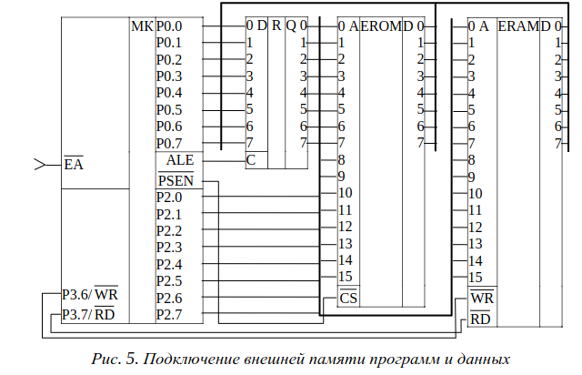
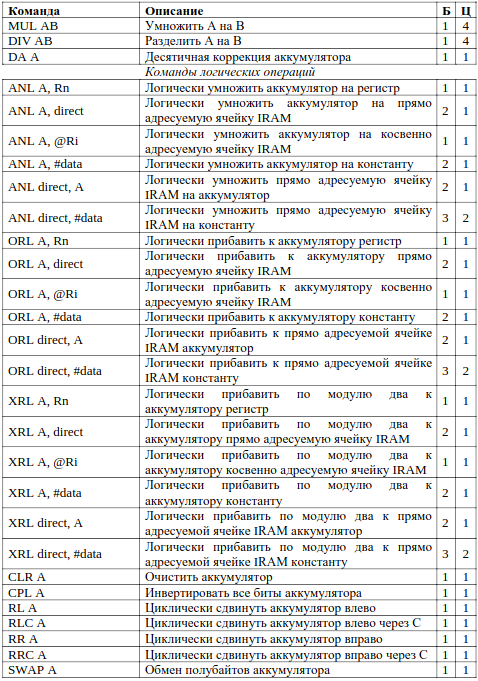

# MCS-51

MCS-51 (или 8051) – это семейство 8-разрядных микроконтроллеров (МК),
разработанное компанией Intel.

## Характеристики

- 8-разрядный процессор,
- внутренняя (встроенная) память программ (RAM), объем которой
зависит от модели МК,
- внутренняя память данных (RAM) объемом 265 байт,
- возможность подключения внешней памяти данных и программ до
64 Кбайт каждая,
- глубина стека 256 байт,
- 32 программируемых вывода (4 8-разрядных порта ввода-вывода),
- полнодуплексный последовательный порт,
- три 16-разрядных таймера/счетчика,
- 8 источников прерываний,
- битовый процессор (для работы с битами информации),
8
- 256 прямоадресуемых бит,
- есть операции умножения и деления,
- стандартная тактовая частота – 12 МГц.


## Выходы

* XTAIL1, XTAIL2 – выводы для подключения внешнего тактового
генератора;
* ALE/PROG, EA/VPP, PSEN, WR, RD – выводы для передачи управляющих
сигналов при использовании внешней памяти программ и данных (подробнее о
подключении внешней памяти см. в разделе 1.3), а также для записи в память
программ
* INT0, INT1 – входы внешних прерываний;
* T0, T1, T2, T2EX – выводы для подачи внешних сигналов таймерам-
счетчикам 0, 1 и 2;
* RxD, TxD – приемник и передатчик последовательного порта;
* P1.0…P1.7, P3.0…P3.7 – выводы двунаправленных 8-битных портов 1 и 3,
имеют альтернативные функции, связанные с периферийными устройствами;
* P0.0…P0.7, P2.0…P2.7 – выводы двунаправленных 8-битных портов 0 и 2,
выполняют альтернативные функции при подключении внешней памяти
программ и данных.

## Схема


## Архитектура центрального процессора

Центральный процессор большинства микроконтроллеров состоит из **дешифратора команд**, блока арифметико-логического устройства (**АЛУ**) и **блока управления программой**

**Дешифратор команд** производит декодирование команды и формирование управляющих сигналов, необходимых для ее выполнения.

Блок **АЛУ** производит большую часть операций над данными и состоит из арифметико-логического устройства, аккумулятора A, регистров B и PSW (подробнее см. раздел 1.3). АЛУ производит операции как над 8-битными данными, так и над отдельными битами.

**Блок управления программой** управляет последовательностью, в которой
выполняются команды, расположенные в памяти программ. 16-битный
программный счетчик PC (Program counter) содержит адрес следующей для
выполнения команды.

### Длительность цикла

Длительность машинного цикла в микроконтроллерах семейства MCS-51
составляет 12 тактовых импульсов. Все команды выполняются в течение одного
или двух машинных циклов за исключением команд умножения и деления,
выполнение которых занимает 4 машинных цикла (подробнее см. раздел 1.4).

## Организация памяти

Так как микроконтроллеры семейства MCS-51 реализованы в соответствии с гарвардской архитектурой, они имеют раздельные (физически и логически) адресные пространства памяти – ***память программ*** и ***память данных***.

### Память программ

*Память программ* **предназначена для хранения кода исполняемой микроконтроллером программы**. Эта память, как правило, является энергонезависимой (информация в ней сохраняется при выключении питания) и доступной только для чтения.

Объем внутренней памяти программ (IROM) семейства MCS-51 зависит от конкретной модели и составляет от 0 до 64 Кбайт. Для работы моделей, не имеющих внутренней памяти программ, необходимо подключение внешней памяти программ.


У любых МК семейства MCS-51 имеется возможность подключения внешней памяти программ объемом до 64 Кбайт.

Если на выводе $\bar{EA}$ микроконтроллера высокий уровень напряжения и значение программного счетчика PC не превышает максимальный адрес внутренней памяти программ, то МК обращается к внутренней памяти.

Если на выводе $\bar{EA}$ микроконтроллера низкий уровень напряжения или значение PC превышает максимальный адрес внутренней памяти программ, то МК обращается к внешней памяти программ.

При включении или сбросе МК, содержимое PC обнуляется и программа начинает выполняться с адреса **0h**. Этот адрес называется *вектором сброса МК*.

Блок памяти программ с адресами **03h – 2Bh** обычно содержит *векторы прерываний*. Нижняя граница блока векторов прерываний может отличаться для разных моделей МК, подробнее см. в описании работы, посвященной системе прерываний.

### Память данных

Большинство МК семейства MCS-51 имеют внутреннюю память данных объемом 256 байт. Кроме этого, также имеется возможность подключения внешней памяти данных объемом до 64 Кбайт.

На кристалле МК размещаются три физически разделенных блока внутренней памяти данных: **блок младших 128 байт IRAM с адресами *00 – 7Fh***,
**блок старших 128 байт IRAM с адресами *80h – FFh*** и **блок регистров специальных функций SFR, размещенный по адресам *80h – FFh*.**

Так как старшие 128 байт внутренней памяти данных и область SFR имеют одинаковое адресное пространство, для обращения к ним используют разные способы адресации.


Младшие 128 байт IRAM в отличие от других областей внутренней памяти данных в свою очередь подразделяются на три области (рис. 4).

Первые (младшие) 32 байта IRAM (с адреса ***00 по 1Fh***) сгруппированы **в четыре банка по 8 регистров общего назначения (РОН) с именами R0 – R7 в каждом**. **Выбор рабочего (текущего) банка регистров осуществляется программно с помощью управляемых бит RS0 и RS1 слова состояния PSW** (табл. 3). Отличительной особенностью блока рабочих регистров является возможность использования, наряду с прямой и косвенной адресацией, прямой регистровой адресации. При старте МК рабочим является банк 0.

Следующие 16 байт IRAM (с адреса ***20h по 2Fh***) представляют собой область **128 прямо адресуемых бит (может быть использована для хранения 128 программно-управляемых пользовательских флагов)**. Обращение к каждому из указанных флагов может быть произведено двумя способами: **указанием прямого адреса бита (например, 7Ch)** или **указанием номера бита в байте (например, 2Fh.4)**. Каждый из 16 байт этой области допускает прямую и косвенную побайтовую адресацию.


Оставшиеся 80 байт из области младших 128 байт IRAM и вся область старших 128 байт IRAM адресуется побайтно

### Регистры специального назначения

Блок регистров специального назначения (Special function register, SFR) содержит различное число регистров (в зависимости от модели МК). В качестве примера в табл. 2 приведены регистры SFR микроконтроллера AT89C52. Большинство регистров, приведенных в табл. 2, есть у любого МК семейства MCS-51.

Регистры с адресами, кратными восьми, допускают побитную адресацию (отмечены * в табл. 2).


Блок SFR содержит две группы регистров: регистры ядра МК и регистры
периферийных устройств.

Все регистры ядра МК, за исключением программного счетчика PC и
четырех банков регистров общего назначения, представлены в области SFR. Это
регистры A (ACC), B и PSW блока АЛУ, а также регистры-указатели SP, DPTR.

Аккумулятор ACC предназначен для хранения операндов при выполнении
арифметических и логических операций. Допускается обозначение аккумулятора
как А.

Регистр B используется в качестве регистра-расширителя аккумулятора при
выполнении операций умножения и деления. При выполнении других операций
регистр В может использоваться как регистр общего назначения.

Информация о состоянии выполняемой программы содержится в регистре
PSW (табл. 3).


Флаг C устанавливается, если операция приводит к переносу из старшего
бита результата (переполнение разрядов) или заему в старший бит результата
(отрицательный результат). При отсутствии переноса и заема флаг C
сбрасывается.

Флаг AC устанавливается, если операция приводит к переносу из младшего
полубайта в старший (при сложении) или заему в младший полубайт из старшего
(при вычитании). При отсутствии межтетрадного переноса и заема флаг AC
сбрасывается.

Флаг OV устанавливается, если операция приводит к переносу в старший бит
результата, но не к переносу из старшего бита, или наоборот (при отсутствии
переноса в старший бит, но при наличии переноса из старшего бита). В
противном случае OV сбрасывается. Таким образом, флаг OV фиксирует
переполнение для чисел со знаком. Отрицательные числа представляются в МК
дополнительном коде, поэтому в знаковом представлении числа с нулевым
старшим битом (от 00h до 7Fh) считаются положительными, а числа с единичным
старшим битом (от 80h до FFh) – отрицательными. Флаг OV устанавливается,
например, если результат сложения двух положительных чисел превышает 7Fh,
или если результат вычитания из отрицательного числа получился меньше 80h.
Флаг P обновляется в каждом машинном цикле: устанавливается, если число
единиц в аккумуляторе нечетно, и сбрасывается, если число единиц в
аккумуляторе четно. Флаг программно недоступен: при записи в PSW флаг P не
изменяется.
Флаг F0 предназначен для свободного использования программистом.
Команды, приводящие к изменению флагов С, AC и OV, приведены в разделе
1.4 (табл. 7).
Указатель стека SP (Stack pointer) может адресовать любую область IRAM.
Глубина стека не может превышать 256 байт. При загрузке данных в стек сначала
осуществляется инкремент SP, а затем выполняется запись в стек. При чтении
данные извлекаются из стека, а затем производится декремент SP.
С помощью 16-разрядного указателя данных DPTR (Data pointer)
обеспечивается косвенная адресация операндов при обращении к внешней памяти
данных и программ.

### Подключение внешней памяти программ и данных

В микроконтроллерах семейства MCS-51 имеется возможность подключения
внешней памяти программ (EROM) и данных (ERAM) объемом до 64 Кбайт
каждая. Механизм обращения МК к внешней памяти предусматривает
подключение микросхем памяти к выводам портов Р0 и Р2 и P3 с использованием
внешнего регистра. Схема одновременного подключения 64 Кбайт внешней
памяти программ и данных изображена на рис. 5.
При доступе к внешней памяти программ и данных 16-разрядный адрес
формируется на выводах порта P0 (младший байт) и порта P2 (старший байт).
Выдаваемый через порт Р0 младший байт адреса фиксируется во внешнем
регистре R по спаду сигнала ALE (Address Latch Enable), после чего линии порта
Р0 используются как шина данных.
Доступ к внешней памяти программ разрешен либо если присутствует
низкий уровень напряжения на входеEA , либо, если содержимое счетчика
команд PC превышает значение максимального адреса внутренней памяти.
Чтение из внешней памяти программ происходит по спаду сигнала на выводеPSEN
(Program Store ENable), выполняющего функцию разрешающего сигнала
чтения EROM.



Чтение внешней памяти данных происходит по спаду сигнала на выводе $\bar{RD}$ ,
а запись – по спаду сигнала на выводе $\bar{WR}$.

## Система команд

Система команд микроконтроллеров семейства MCS-51 состоит из 111 команд, выполняющих 54 операции (табл. 6). Операции производятся над данными четырех типов: битами, тетрадами (4-битными словами), байтами и 16-битными словами, при этом большинство операндов являются байтами.

Машинные коды команд представляются одним, двумя или тремя байтами. Команды выполняются за один или два машинных цикла. Исключение составляют команды умножения и деления, длительность исполнения которых равна 4 машинным циклам.

### Способы адресации

Для доступа к операндам используются **пять способов адресации** (табл. 4). Указанные способы адресации обеспечивают обращение к операндам-источникам. При обращении к операндам-приемникам непосредственная и базово-индексная адресации не используются.


Регистровая адресация применяется для адресации регистров A, B, DPTR, флага С, также восьми регистров R0 – R7 текущего (рабочего) банка регистров. Номер регистра содержится в байте кода операции.

Прямая адресация, т.е. адресация с указанием 8-битного адреса операнда во втором или третьем байте команды, используется при обращении к младшим 128 байтам IRAM, регистрам блока SFR и прямо адресуемым битам. К последним относятся 128 бит из битовой области IRAM (рис. 4), а также биты регистров SFR, отмеченных * в табл. 2.

Операндом команды с непосредственной адресацией является константа, расположенная во втором или втором и третьем байтах команды.

При косвенной адресации происходит обращение к ячейке памяти, адрес которой содержится в регистре R0, R1 или DPTR. С использованием регистров R0 и R1 возможно организовать доступ к 256 байтам IRAM, а также к 256 байтам ERAM. Доступ в пределах 64 Кбайт может быть организован с помощью регистра DPTR. Для адресации старших 128 байт IRAM допустима только косвенная адресация. Отметим, что косвенная адресация через регистр SP используется в командах, производящих операции со стеком.

Для чтения памяти программ используется базово-индексная адресация, обеспечивающая формирование адреса выбираемого байта путем сложения 8-битного содержимого аккумулятора (исполняющего роль индексного регистра) с 16-битным содержимым DPTR или PC (исполняющего роль базового регистра). Такой способ адресации удобно применять для обращения к элементам массива данных, расположенного в памяти программ (пример использования приведен в описании работы с дисплеем).

Для обозначения типов данных и способов адресации в мнемониках команд применяются следующие обозначения


### Виды команд

Множество команд микроконтроллера может быть разделено на 4 группы:

1) команды передачи данных,  
2) команды арифметических операций;  
3) команды логических операций;  
4) команды управления переходами.  

### Команды передачи данных

Команды этой группы делятся на три класса: команды общего назначения, команды аккумулятора и команды DPTR.

#### Общего назначения

**MOV** выполняет пересылку байта или бита из операнда-источника в операнд-
приемник.  
**PUSH** инкрементирует (увеличивает на 1) регистр SP, а затем выполняет
пересылку байта-источника по адресу, содержащемуся в SP.  
**POP** выполняет пересылку байта, расположенного по адресу, содержащемуся
в SP, в операнд-приемник, а затем декрементирует (уменьшает на 1) регистр SP.

#### Команды пересылки аккумулятора

**XCHG** осуществляет обмен байта-источника с аккумулятором A.

**XCHD** осуществляет обмен младшего полубайта (с 0 по 3 биты) байта-источника с младшим полубайтом аккумулятора A.

**MOVX** выполняет передачу байта между ячейкой внешней памяти данных (ERAM) и аккумулятором. Адрес ячейки задается в регистре DPTR (16-битный адрес) или в регистре R0 или R1 (8-битный адрес).

**MOVС** выполняет передачу байта из памяти программ (ROM) в аккумулятор. Адрес ячейки задается в регистре DPTR (16-битный адрес) или в регистре R0 или R1 (8-битный адрес). Содержимое A до передачи используется в качестве индекса в 256-байтном массиве, адрес начала которого содержится в базовом регистре (DPTR или PC).

#### Команды пересылки DPTR

**MOV DPTR, #data16** загружает 16-битную константу в регистр DPTR (представлен в области SFR в виде регистровой пары: DPH и DPL).

### Команды арифметических операций

Микроконтроллер выполняет четыре арифметических операции. Операции выполняются над восьмибитными беззнаковыми числами, однако флаг переполнения (см. раздел 1.3.2) позволяет использовать операции сложения и вычитания как для беззнаковых операндов, так и для операндов со знаком. Арифметические операции также могут напрямую производиться с числами в коде BCD.

#### Сложение

**INC** (инкремент) прибавляет единицу к операнду-источнику и помещает
результат в операнд.

**ADD** прибавляет аккумулятор к операнду-источнику и возвращает результат
в аккумулятор.

**ADDС** прибавляет аккумулятор к операнду-источнику, затем прибавляет 1,
если флаг C был установлен, и возвращает результат в аккумулятор.

**DA** используется для коррекции результата после операции сложения двух
чисел в коде BCD (двоично-десятичный код – каждый разряд десятичного числа
представляется четырьмя битами, например $96_{10} = 1001 0110_{BCD}$). Результат
коррекции записывается в аккумулятор. Флаг C устанавливается, если результат
превышает $99_{10}$, иначе C сбрасывается.

#### Вычитание

**SUBB** вычитает из аккумулятора операнд-источник, затем вычитает 1, если
флаг C был установлен, и возвращает результат в аккумулятор. Операция
вычитания производится путем сложения уменьшаемого с дополнительным
кодом вычитаемого.

**DEC** (декремент) вычитает единицу из операнда-источника и помещает
результат в операнд.

#### Умножение

**MUL** выполняет умножение аккумулятора А на регистр B. Сомножители интерпретируются как восьмибитные беззнаковые числа. Результат умножения занимает два байта: младший байт помещается в аккумулятор, старший – в регистр B. Флаг С сбрасывается. Флаг OV устанавливается, если старший байт результата не нулевой, в противном случае OV сбрасывается.

#### Деление

**DIV** выполняет деление аккумулятора А на регистр B. Операнды интерпретируются как восьмибитные беззнаковые числа. Целая часть частного помещается в аккумулятор, остаток – в регистр B. Флаг С сбрасывается. Флаг OV устанавливается в случае деления на ноль, в противном случае OV сбрасывается.

### Логические операции

#### Унарные

**CLR** обнуляет операнд. Операндом может быть аккумулятор или любой прямо адресуемый бит.

**SETB** записывает 1 в операнд. Операндом может быть любой прямо адресуемый бит.

**CPL** инвертирует операнд.

**RL, RLC, RR, RRC и SWAP** – пять сдвиговых операций, которые могут быть
применены только к аккумулятору

RL RR - влево вправо **циклически**

RLC RRC - влево вправо **циклически с использованием C**

SWAP меняет местами старший и младший полубайты

#### Бинарные

**ANL** Побитовое И, результат в первый операнд

**ORL** Побитовое ИЛИ

**XRL** XOR

### Команды управления

К командам этой группы относятся **команды безусловных переходов**,
**условных переходов** и **возврата из прерываний**.

#### Безусловные переходы

**ACALL** - двухбайтная команда **вызова подпрограммы**, используется, если адрес подпрограммы расположен в пределах текущей 2Кбайтной страницы памяти программ. ACALL помещает в стек двухбайтный адрес следующей за ней в памяти программ команды (т.е. содержимое PC, адрес возврата), а затем заменяет в программном счетчике PC 11 младших бит на 11-битное значение адреса, указанное в операнде. Таким образом, если команда ACALL занимает два последних байта на 2Кбайтной странице, переход будет осуществлен на следующую страницу памяти программ.

**LCALL** – трехбайтная команда **вызова подпрограммы**, используется для адресации всего 64Кбайтного адресного пространства памяти программ. LCALL помещает в стек адрес следующей за ней в памяти программ команды (т.е. содержимое PC, адрес возврата), а затем помещает в программный счетчик PC 16-битное значение адреса подпрограммы, указанное в операнде

**RET** (возврат из подпрограммы) извлекает из стека два байта (адрес возврата, помещенный в стек предшествующей операцией CALL) и помещает их в PC. При этом значение SP уменьшается на 2

**AJMP** – двухбайтная команда **безусловного перехода**, используется, если адрес перехода расположен в пределах текущей 2Кбайтной страницы памяти программ. AJMP заменяет в программном счетчике PC (содержащем адрес следующей за AJMP команды) 11 младших бит на 11-битное значение адреса, указанное в операнде.

**LJMP** – трехбайтная команда безусловного перехода, используется для адресации всего 64Кбайтного адресного пространства памяти программ. LJMP помещает в программный счетчик PC 16-битное значение адреса, указанное в операнде.

**SJMP** – двухбайтная команда **короткого безусловного перехода**, используется, если адрес перехода расположен на расстоянии от -128 до 127 байт от следующей за SJMP команды. SJMP прибавляет к программному счетчику PC (содержащему адрес следующей за SJMP команды) значение смещения (интерпретируется как число со знаком), указанное в операнде.

**JMP @A+DPTR** – однобайтная команда безусловного перехода, используется
для адресации всего 64Кбайтного адресного пространства памяти программ. JMP
помещает в программный счетчик PC 16-битную сумму аккумулятора
(интерпретируется как беззнакове число) и регистра DPTR

#### Команды условных переходов

Эта группа команд осуществляет короткий переход только при выполнении определенных условий. Адрес перехода должен быть расположен на расстоянии от -128 до 127 байт от следующей команды. При выполнении соответствующего условия к программному счетчику PC (содержащему адрес следующей команды) прибавляется значение смещения (интерпретируется как число со знаком), указанное в операнде.

**JZ** осуществляет переход, если аккумулятор равен нулю.  
**JNZ** осуществляет переход, если аккумулятор не равен нулю.  
**JC** осуществляет переход, если флаг С равен единице.  
**JNC** осуществляет переход, если флаг С равен нулю.  
**JB** осуществляет переход, если бит-операнд равен единице.  
**JNB** осуществляет переход, если бит-операнд равен нулю.  
**JBC** осуществляет переход, если бит-операнд равен единице и записывает ноль в этот бит.  
**CJNE** сравнивает первый и второй операнды и выполняет переход, если операнды не равны. Флаг C устанавливается, если первый операнд меньше второго. В противном случае флаг C сбрасывается.  
**DJNZ** уменьшает на 1 (декрементирует) операнд-источник и возвращает результат в операнд. Переход осуществляется, если результат не равен нулю.  

#### Команда возврата из прерывания

**RETI** извлекает из стека два байта (адрес возврата, помещенный в стек при переходе по вектору прерывания) и помещает их в PC. При этом значение SP уменьшается на 2. Разрешает прерывания с текущим уровнем приоритета.

### Список команд

Полный перечень команд микроконтроллера приведен в табл. 6. В столбце Б указано количество байт, занимаемых командой в памяти программ. В столбце Ц приведено количество машинных циклов, необходимых для выполнения команды.





## Программирование 


Квадратными скобками обозначены необязательные части строки

Файл рекомендуется оформлять согласно следующему шаблону:

```asm
;*******************************************************************
; *
; Filename: *
; Date: *
; File Version: *
; Author: *
; Company: *
; Description: *
; *
;*******************************************************************
; Variables
;*******************************************************************
; TODO PLACE VARIABLE DEFINITIONS HERE
;*******************************************************************
; Reset Vector
;*******************************************************************
org 0h ; processor reset vector
ajmp start ; go to beginning of program
;*******************************************************************
; Interrupt Service Routines
;*******************************************************************
; TODO INSERT ISR HERE
;*******************************************************************
; MAIN PROGRAM
;*******************************************************************
org ; let linker place main program
START:
; Insert Your Program Here
sjmp $ ; loop forever
END
```

В тексте программы кроме команд на языке ассемблера используются так называемые директивы компилятора – инструкции компилятору. Директивы позволяют указать адрес размещения кода в памяти программ, задать символьные имена переменных, подключить к проекту дополнительные файлы, использовать конструкции языков высокого уровня при написании программ.

Для задания символьных имен констант используют директиву equ,
например:  
`x equ 18h`

Тогда команда логического умножения бита С на бит с адресом 23h может
быть записана следующим образом.  
`anl c,/x`

Для того чтобы задать адрес размещения кода в памяти программ, используют директивы org и code. Для того чтобы программа начала выполняться при запуске МК, необходимо разместить код, начиная с адреса 00h (адрес вектора сброса (Reset Vector)). При этом, так как блок памяти программ с адресами 03h – 93h содержит векторы прерываний, обычно основной код программы размещают с адреса, большего 93h, а по адресу вектора сброса располагают команду перехода, например:

```asm
org 0h ; processor reset vector
33
ajmp start ; go to beginning of program
…
org 100h
start:
```

Основная программа будет размещена по адресу 100h

Между вектором сброса и основной программой при необходимости по
адресам векторов прерываний (Interrupt Vector) размещают подпрограммы
обслуживания соответствующих прерываний, каждая из которых должна
завершаться командой RETI.
Для размещения байтов данных в памяти программ использую директиву
db. Например, после компиляции программы, содержащей строки, приведенные
ниже, в памяти программ, начиная с адреса 200h будет записано 8 байт:
десятичное число 31, 6 байт, содержащих ASCII-коды символов слова и
десятичное число 20.


```asm
org 200h
DB 31,'August',20
```

### Форматы данных

```asm

db 'string' ; String
mov a,#100111b ; двоичное число
mov a,#47q ; восьмиричное число
mov a,#39d ; десятичное число
mov a,#39 ; десятичное число
mov a,#27h ; шестнадцатеричное число
mov a,#'9' ; Character

```

### Примеры программ

Написать программу, размещающую массив FFh…F0h во внутренней памяти данных(IRAM), начиная с адреса 50h.

```asm

;*******************************************************************
; *
; Filename: ex11.asm *
; Date: 2020/02/07 *
; File Version: 1 *
; Author: Solov’eva T. N. *
; Company: SUAI *
; Description: example 1.1 *
; *
;*******************************************************************
; Reset Vector
;*******************************************************************
org 0h ; processor reset vector
ajmp start ; go to beginning of program
;*******************************************************************
; MAIN PROGRAM
;*******************************************************************
org 100h
start:
mov R0,#050h ; нач. адрес -> R0
mov A,#0FFh ; нач. значение -> А
m1: mov @R0,A
inc R0
dec A
cjne A,#0EFh,m1
sjmp $ ; loop forever
END

```

Программа вычисления логического
выражения $F = \bar{x}y \oplus \bar{r}$, где x, y, r – биты.

Сначала назначим расположение операндов в памяти. Пусть операнды x, y, r
и бит промежуточного результата (обозначим его buf) находятся в младших
разрядах ячейки с адресом 23h (рис. 4 и 7), а бит значения результата (обозначим
его rez) – в старшем разряде ячейки с адресом 2Dh. При написании программы
вместо адресов операндов удобно использовать символьные имена. Для этого
применяется директива компилятора equ.


Необходимо учесть, что в битовых командах МК нет операции сложения по
модулю два, поэтому исходное выражение придется видоизменить:

$F=\bar{x}yr \lor \bar{\bar{x}y}\bar{r}$

Результат:

```asm
;*******************************************************************
; *
; Filename: ex12.asm *
; Date: 2020/02/07 *
; File Version: 0 *
; Author: Solov’eva T. N. *
; Company: SUAI *
; Description: example 1.2 *
; *
;*******************************************************************
x equ 18h
y equ 19h
r equ 1ah
buf equ 1bh
rez equ 6fh;
;*******************************************************************
; Reset Vector
;*******************************************************************
RES_VECT CODE 0x0000 ; processor reset vector
SJMP START ; go to beginning of program
;*******************************************************************
; MAIN PROGRAM
;*******************************************************************
MAIN_PROG CODE 0x0100
START:
mov c,y ;у -> c
anl c,/x ;/x*у -> c
anl c,r ;/x*у*r -> c
mov buf,c ;/x*у*r -> buf
mov c,y ;у -> c
anl c,/x ;/x*у -> c
cpl c ;/(/x*у) -> c
anl c,/r ;/(/x*у)*/r -> c
orl c,buf ;F -> c
mov rez,c ;F -> rez
SJMP $ ; loop forever
END
```
