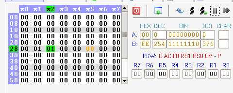

# Цель работы

Изучение архитектуры ядра и системы команд
микроконтроллеров семейства MCS-51; приобретение навыков программирования
микроконтроллеров.

# Задание

Необходимо разработать три программы на языке ассемблера MCS-51:

1) программу для вычисления зада арифметического выражения (для всех операциях полагайте, что операнды и результат – целые однобайтные числа; результат вычислений разместите в ячейке внутренней памяти данных 30h);
2) программу для записи заданного массива чисел во внешнюю память данных;
3) программу на ассемблере битового процессора для вычисления заданного логического выражения (результат выполнения разместите в любой ячейке памяти данных битового процессора). Работу программ необходимо проверить с помощью симулятора.

## Персональное задание. Вариант 33

Арифметическое выражение:

$$ 
0.25(\frac{X}{Z} - Y)(2Y + Z) 
$$

Последовательность элементов массива:

$$
0h...20h...0h...10h...0h 
$$

Логическое выражение:

$$
x\bar{r} \lor \bar{y} \oplus d
$$

# Решение

## Программа 1

Было решено положить аргументы x, y и z, а также переменную buf для промежуточного результата и результата в ячейки памяти с адресами 28h, 29h, 2ah, 2bh и 30h соответственно.

Затем была написана программа решающая задачу

\verbatiminput{./prog.asm}

В режиме симуляции в соответствующие ячейки были положены аргументы функции


После пошагового выполнения в ячейку результата установилось значение 4, что и является результатом арифметического выражения


## Программа 2

Для записи значения во внешнее устройство был использован код вида

```asm
MOV DPTR, #адрес 
MOV A, #значение ; значение для записи
MOVX @DPTR, A ; перемещаем значение в ячейку
```

### Код программы:

\verbatiminput{./prog1.asm}

### Результат


## Программа 3

Исходное логическое выражение, вследствие отсутствия xor в языке для битов, было преобразовано в следующее

$$
\overline{(x\bar{r} \lor \bar{y})}d \lor (x\bar{r} \lor \bar{y})\bar{d}
$$
$$
\overline{x\bar{r}}yd \lor x\bar{r}\bar{d} \lor \bar{y}\bar{d}
$$
$$
\bar{x}yd \lor ryd \lor x\bar{r}\bar{d} \lor \bar{y} \bar{d}
$$


### Код программы

\verbatiminput{./prog2.asm}

### Результат




# Вывод

Изучена архитектура ядра и системы команд микроконтроллеров семейства MCS-51; приобретены навыки программирования микроконтроллеров.