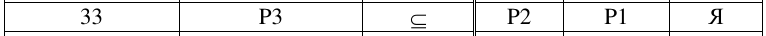
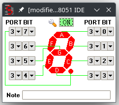
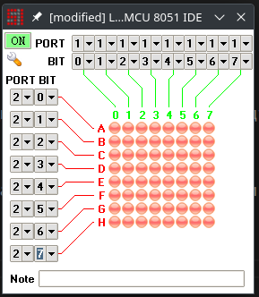
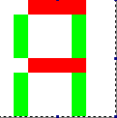
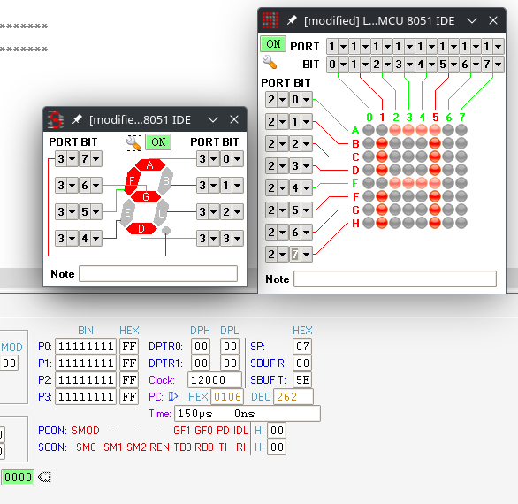

# Цель работы

Приобретение навыков организации взаимодействия микроконтроллера с простейшими устройствами вывода, знакомство с принципом динамической индикации.

# Задание

Требуется разработать программу на языке ассемблера MCS-51 для вывода заданных символов на семисегментный индикатор (с общим катодом – для четных вариантов, с общим анодом – для нечетных) и светодиодную матрицу 8 х 8. Выводы, через которые к МК подключается индикатор и матрица, а также символы, которые необходимо вывести на индикатор и матрицу, указаны в разделе «Варианты заданий». Работу программы необходимо проверить с помощью симулятора.

## Задание по варианту 33

Семисегментный индикатор с общим анодом

# Разработка программы

Для начала был подключен led индикатор с общим анодом к третьему выходу согласно варианту

Для вывода указанного символа необходимо подать ноль на биты 0, 3, 5 и 6.

Затем была подключена матрица столбцами к порту 1, а строками к порту 2 согласно варианту.

Для вывода символа "Я", нам необходимо два шага

В первом мы зажигаем центральные 4 светодиода в 0-й и 4-й строках. Во втором мы зажигаем 1-й и 5-й светодиоды на всех строках кроме 0-й и 4-й. 

Для алгоритма была составлена программа

\verbatiminput{./prog-led.asm}

На рисунке 5 представлен результат работы программы

# Вывод

В результате выполнения работы разработана программа на
языке ассемблера MCS-51 для вывода символов на семисегментный индикатор и
светодиодную матрицу. Проверка работоспособности программы произведена в
среде MCU 8051 IDE. Приобретены навыки организации взаимодействия
микроконтроллера с простейшими устройствами вывода.