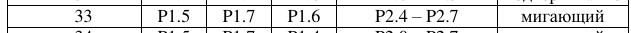

# Цель работы

Приобретение навыков организации взаимодействия микроконтроллера с устройствами вывода на примере жидкокристаллического знакосинтезирующего дисплея.

# Задание

Требуется разработать программу на языке ассемблера MCS-51 для вывода на экране ЖКИ двух заданных строк. Строки необходимо выровнять по центру экрана, при этом содержимое строк, расположенное в памяти программ, не должно содержать пробелы до первого и после последнего символа.

## Задание по варианту 33

1 Строка: номер группы  
2 Строка: И.О. Фамилия  

Шина управления ЖКИ:  
RS: P1.5  
RW: P1.7  
E: P1.6

Шина данных ЖКИ: P2.4-P2.7

Вид курсора: мигающий

# Разработка программы

# Вывод

В результате выполнения работы разработана программа на языке ассемблера MCS-51 для вывода на экране ЖКИ двух заданных строк. Проверка работоспособности программы произведена в среде MCU 8051 IDE. Приобретены навыки организации взаимодействия микроконтроллера с устройствами вывода на примере жидкокристаллического знакосинтезирующего дисплея